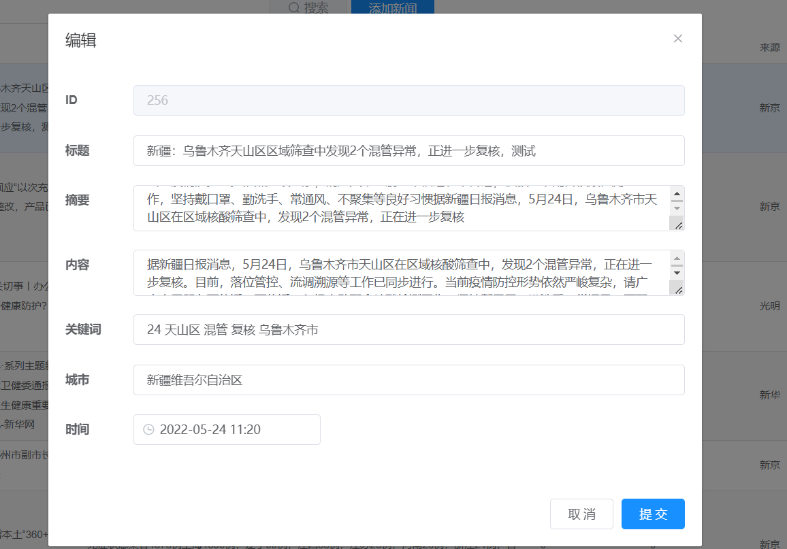
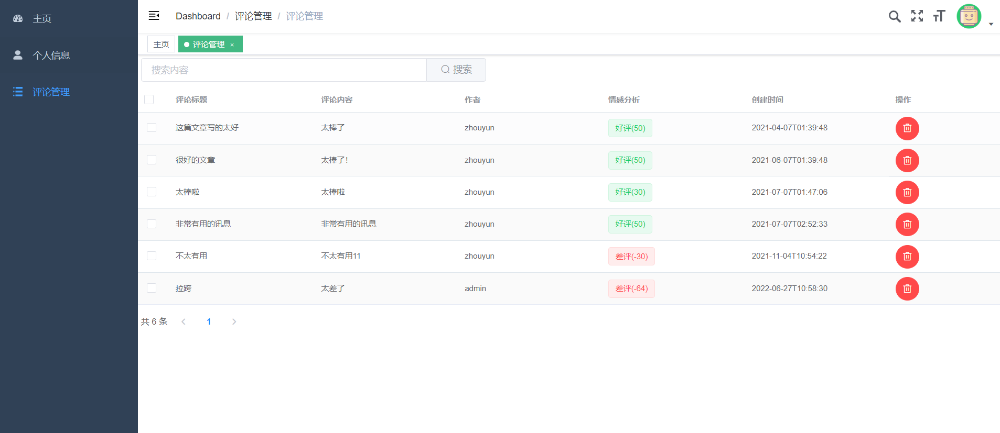
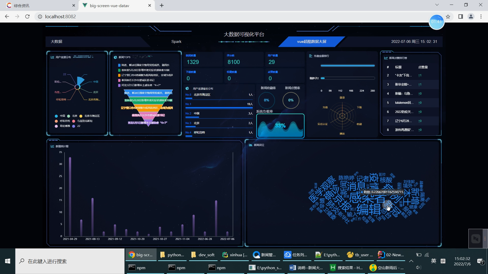
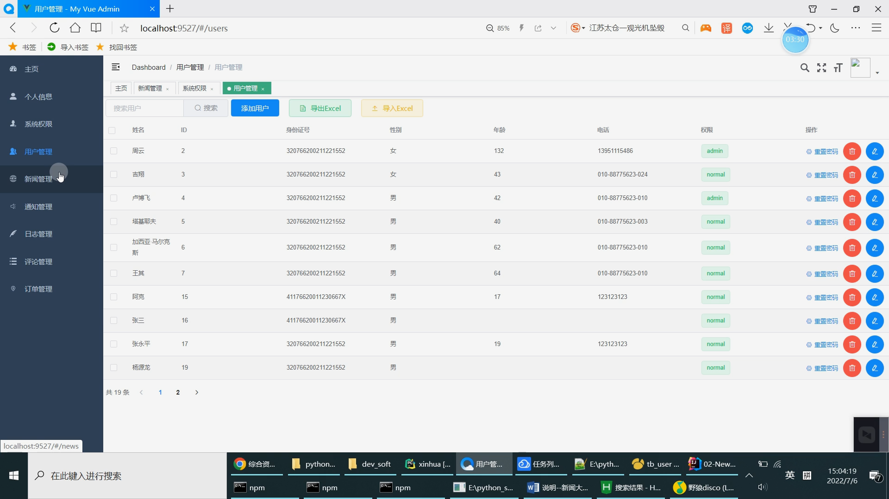
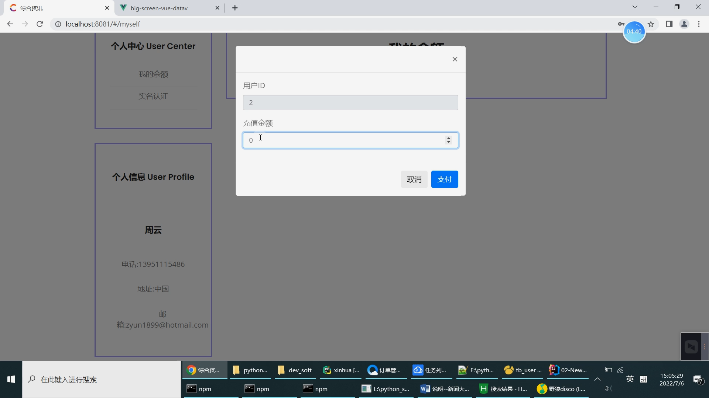
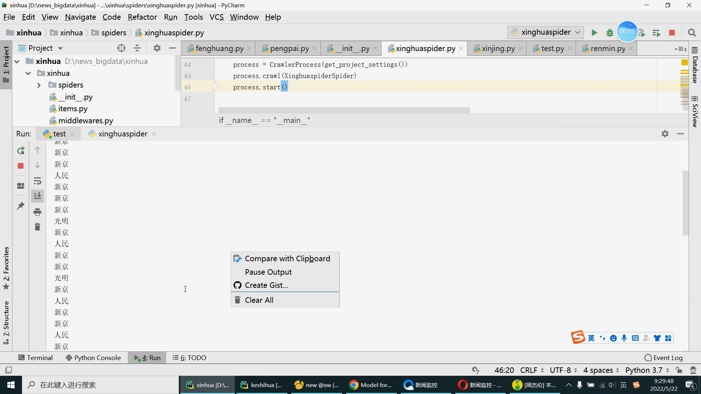

## Python+Spark+Scrapy爬虫新闻推荐系统 新闻爬虫 新闻可视化 新闻情感分析预测 新闻推荐系统 新闻大数据分析 新闻数据分析 大数据毕业设计

## 要求
### 源码有偿！一套(论文 PPT 源码+sql脚本+教程)

https://www.bilibili.com/video/BV1YB4y1H7KU?spm_id_from=333.999.0.0

### 
### 加好友前帮忙start一下，并备注github有偿获取源码
### 我的QQ号是798059319或者 1679232425

# 麻烦百十块买代码或者白嫖的直接别来了！不缺你那几毛钱！全中国只有我卖大数据毕设(不信自己百度搜大数据毕业设计)！没人惯着你！

### 加qq好友说明（被部分 网友整得心力交瘁）：
    1.加好友务必按照格式备注
    2.避免浪费各自的时间！
    3.当“客服”不容易，repo 主是体面人，不爆粗，性格好，文明人。

## 开发技术
Hadoop、Spark、SparkSQL、Python、Scrapy爬虫框架、MySQL、协同过滤算法(双算法，基于用户、基于物品全实现)、阿里云短信、百度AI人工智能识别、支付宝沙箱支付、echarts

全中国首创自研Python+SpringBoot+Vue.js+Spark【大数据+web+机器学习】智能开发平台，不仅能够弥补开发者前后端分离网站开发的短板，还能迅速完成大数据、机器学习、算法的开发，我相信我的架构很快会在中国计算机毕业设计里面成为领军框架典范

使用TD-IDF等机器学习算法完成新闻情感分析

# 整体架构设计

Java端API接口中台系统

大屏统计端

用户网页端(实时推荐)

管理员网页管理端

全中国首创自研Python+SpringBoot+Vue.js+Spark【大数据+web+机器学习】智能开发平台，不仅能够弥补开发者前后端分离网站开发的短板，还能迅速完成大数据、机器学习、算法的开发，我相信我的架构很快会在中国计算机毕业设计里面成为领军框架技术

 

 

# 系统创新点

大屏统计可视化

用户网页端(实时推荐，使用双算法，基于用户、基于物品全实现) 

Python的Scrapy爬虫

短信接口修改密码或者注册

支付宝沙箱支付(网页)

身份证自动识别认证

全中国首创自研Python+SpringBoot+Vue.js+Spark【大数据+web+机器学习】智能开发平台，不仅能够弥补开发者前后端分离网站开发的短板，还能迅速完成大数据、机器学习、算法的开发，我相信我的架构很快会在中国计算机毕业设计里面成为领军框架技术

使用TD-IDF等机器学习算法完成新闻情感分析

# 运行截图

## 创新点

使用Python的Scrapy爬虫技术爬取多站点新闻数据；

使用TD-IDF等机器学习算法完成新闻情感分析

使用短信接口完整前端用户通过手机号修改密码功能；

使用支付宝沙箱支付完成充值功能(付费下载)；

使用百度AI图像识别接口完成用户认证身份证自动识别功能；

使用apache-echarts+SparkSQL完成数据分析+大屏统计

# 运行视频(B站)

https://www.bilibili.com/video/BV1YB4y1H7KU?spm_id_from=333.999.0.0

